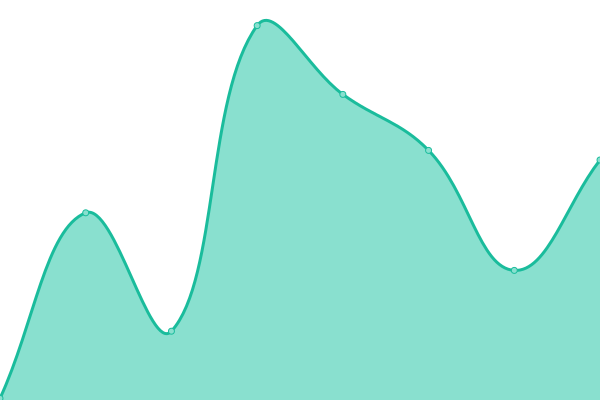

# [📈 Live Status](https://GennadySpb.github.io/upptime-yandex-cloud): <!--live status--> **🟧 Partial outage**

This repository contains the open-source uptime monitor and status page for [GennadySpb](https://GennadySpb.github.io/upptime-yandex-cloud), powered by [Upptime](https://github.com/upptime/upptime).

With [Upptime](https://upptime.js.org), you can get your own unlimited and free uptime monitor and status page, powered entirely by a GitHub repository. We use [Issues](https://github.com/GennadySpb/upptime-yandex-cloud/issues) as incident reports, [Actions](https://github.com/GennadySpb/upptime-yandex-cloud/actions) as uptime monitors, and [Pages](https://GennadySpb.github.io/upptime-yandex-cloud) for the status page.

<!--start: status pages-->
<!-- This summary is generated by Upptime (https://github.com/upptime/upptime) -->
<!-- Do not edit this manually, your changes will be overwritten -->
<!-- prettier-ignore -->
| URL | Status | History | Response Time | Uptime |
| --- | ------ | ------- | ------------- | ------ |
|  [Yandex.Cloud Console](https://console.cloud.yandex.ru) | 🟥 Down | [yandex-cloud-console.yml](https://github.com/GennadySpb/upptime-yandex-cloud/commits/HEAD/history/yandex-cloud-console.yml) | 

 0ms
     
 | 

<a href="https://GennadySpb.github.io/upptime-yandex-cloud/history/yandex-cloud-console">0.00%</a>
    

|  [Yandex.Cloud Docs](https://cloud.yandex.ru/docs) | 🟥 Down | [yandex-cloud-docs.yml](https://github.com/GennadySpb/upptime-yandex-cloud/commits/HEAD/history/yandex-cloud-docs.yml) | 

 3398ms
     
 | 

<a href="https://GennadySpb.github.io/upptime-yandex-cloud/history/yandex-cloud-docs">99.29%</a>
    

|  [Yandex.Cloud Status](https://status.cloud.yandex.ru) | 🟥 Down | [yandex-cloud-status.yml](https://github.com/GennadySpb/upptime-yandex-cloud/commits/HEAD/history/yandex-cloud-status.yml) | 

 2190ms
     
 | 

<a href="https://GennadySpb.github.io/upptime-yandex-cloud/history/yandex-cloud-status">99.94%</a>
    

|  [Google](https://www.google.com) | 🟩 Up | [google.yml](https://github.com/GennadySpb/upptime-yandex-cloud/commits/HEAD/history/google.yml) | 

 112ms
     
 | 

<a href="https://GennadySpb.github.io/upptime-yandex-cloud/history/google">100.00%</a>
    

|  [Wikipedia](https://en.wikipedia.org) | 🟩 Up | [wikipedia.yml](https://github.com/GennadySpb/upptime-yandex-cloud/commits/HEAD/history/wikipedia.yml) | 

 207ms
     
 | 

<a href="https://GennadySpb.github.io/upptime-yandex-cloud/history/wikipedia">100.00%</a>
    

<!--end: status pages-->

[**Visit our status website →**](https://GennadySpb.github.io/upptime-yandex-cloud)

## 📄 License

- Code: [MIT](./LICENSE) © [GennadySpb](https://GennadySpb.github.io/upptime-yandex-cloud)
- Data in the `./history` directory: [Open Database License](https://opendatacommons.org/licenses/odbl/1-0/)
