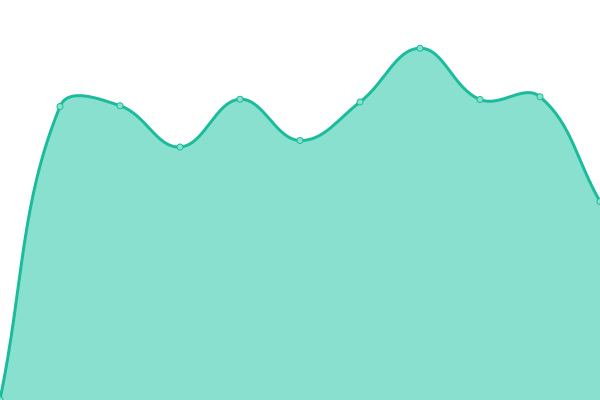
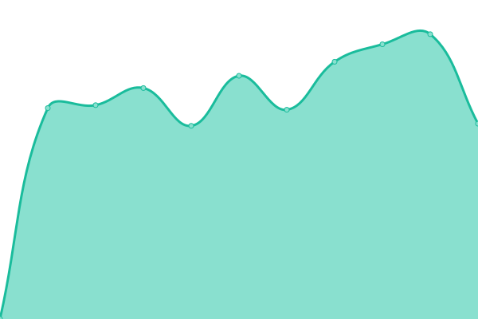
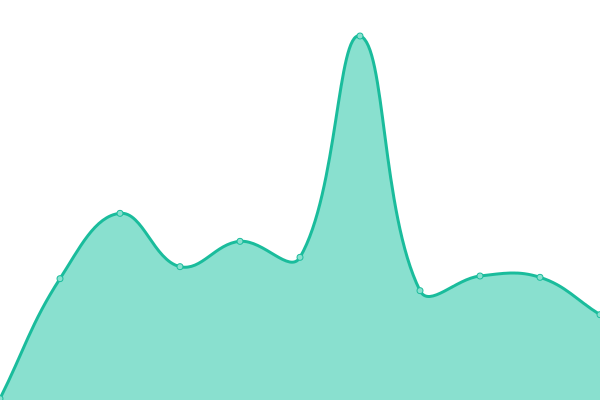
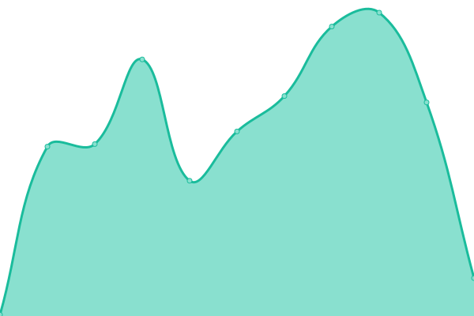

# [📈 Live Status](https://GennadySpb.github.io/upptime-yandex-cloud): <!--live status--> **🟧 Partial outage**

This repository contains the open-source uptime monitor and status page for [GennadySpb](https://GennadySpb.github.io/upptime-yandex-cloud), powered by [Upptime](https://github.com/upptime/upptime).

With [Upptime](https://upptime.js.org), you can get your own unlimited and free uptime monitor and status page, powered entirely by a GitHub repository. We use [Issues](https://github.com/GennadySpb/upptime-yandex-cloud/issues) as incident reports, [Actions](https://github.com/GennadySpb/upptime-yandex-cloud/actions) as uptime monitors, and [Pages](https://GennadySpb.github.io/upptime-yandex-cloud) for the status page.

<!--start: status pages-->
<!-- This summary is generated by Upptime (https://github.com/upptime/upptime) -->
<!-- Do not edit this manually, your changes will be overwritten -->

| URL                                                     | Status  | History                                                                                                                        | Response Time                                                                             | Uptime                                                                                                                                                                                                                                                                   |
| ------------------------------------------------------- | ------- | ------------------------------------------------------------------------------------------------------------------------------ | ----------------------------------------------------------------------------------------- | ------------------------------------------------------------------------------------------------------------------------------------------------------------------------------------------------------------------------------------------------------------------------ |
| [Yandex.Cloud Console](https://console.cloud.yandex.ru) | 🟩 Up   | [yandex-cloud-console.yml](https://github.com/GennadySpb/upptime-yandex-cloud/commits/master/history/yandex-cloud-console.yml) |  709ms |  |
| [Yandex.Cloud Docs](https://cloud.yandex.ru/docs)       | 🟥 Down | [yandex-cloud-docs.yml](https://github.com/GennadySpb/upptime-yandex-cloud/commits/master/history/yandex-cloud-docs.yml)       |  1411ms   |        |
| [Yandex.Cloud Status](https://status.cloud.yandex.ru)   | 🟩 Up   | [yandex-cloud-status.yml](https://github.com/GennadySpb/upptime-yandex-cloud/commits/master/history/yandex-cloud-status.yml)   |  1552ms |    |
| [Google](https://www.google.com)                        | 🟩 Up   | [google.yml](https://github.com/GennadySpb/upptime-yandex-cloud/commits/master/history/google.yml)                             |  71ms                |                              |
| [Wikipedia](https://en.wikipedia.org)                   | 🟩 Up   | [wikipedia.yml](https://github.com/GennadySpb/upptime-yandex-cloud/commits/master/history/wikipedia.yml)                       |  100ms            |                        |

<!--end: status pages-->

[**Visit our status website →**](https://GennadySpb.github.io/upptime-yandex-cloud)

## 📄 License

- Code: [MIT](./LICENSE) © [GennadySpb](https://GennadySpb.github.io/upptime-yandex-cloud)
- Data in the `./history` directory: [Open Database License](https://opendatacommons.org/licenses/odbl/1-0/)
